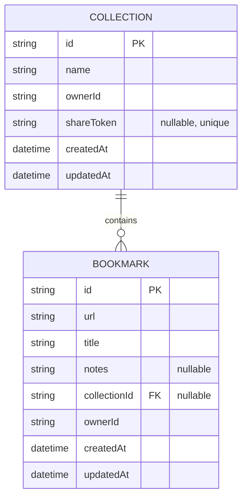
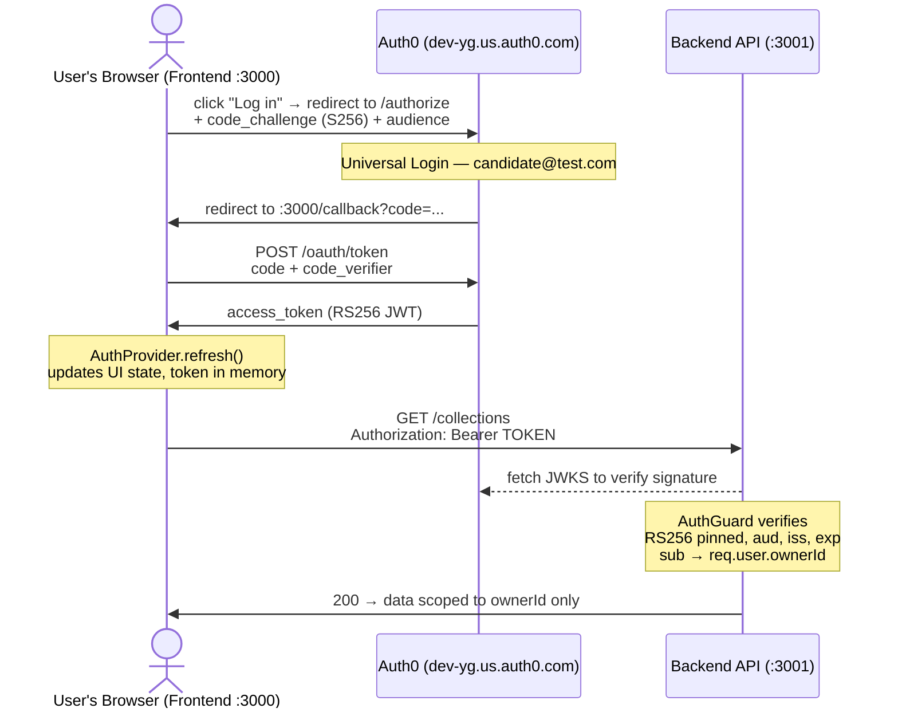
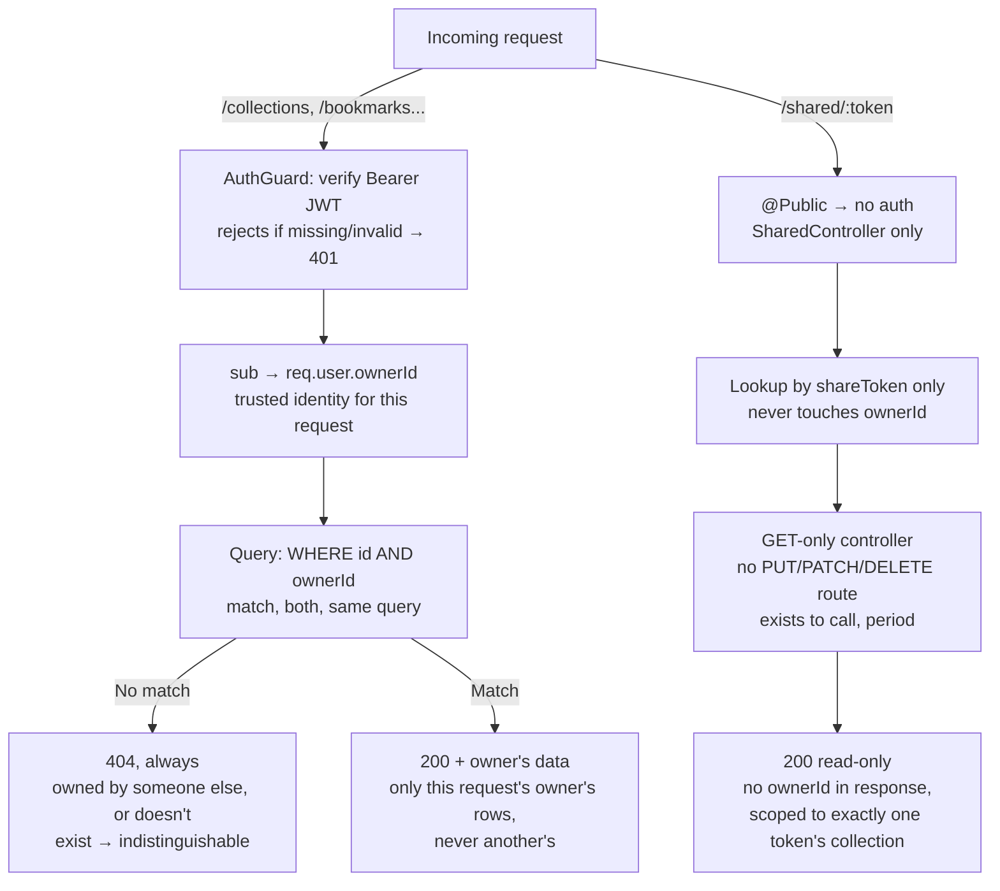

## Data Model



Collection ↔ Bookmark: one collection contains zero or more bookmarks — `collectionId` is nullable (a bookmark can be uncategorized) and `shareToken` is nullable+unique (`null` = not currently shared).

## Authentication

ทุก endpoint (ยกเว้น `/shared/:token`) ต้องมี Bearer access token ที่ผ่านการ verify โดย `AuthGuard` เต็มรูปแบบก่อนถึง controller เสมอ — เหตุผลที่เลือก access token แทน ID token อยู่ใน [DECISIONS.md](DECISIONS.md)



Authorization Code + PKCE ตั้งแต่กด "Log in" จนถึง backend verify token สำเร็จ และ scope response ด้วย `ownerId` ที่ได้จาก `sub` claim เท่านั้น

## /collections

### Endpoints

| Method | Path | Description | Auth |
|---|---|---|---|
| GET | /collections | List collections ของ user ที่ login อยู่ | Required |
| GET | /collections/:id | Get one collection | Required |
| GET | /collections/:id/bookmarks | List bookmarks ใน collection นี้ | Required |
| POST | /collections | Create collection ใหม่ | Required |
| PUT | /collections/:id | Full update | Required |
| PATCH | /collections/:id | Partial update | Required |
| DELETE | /collections/:id | Delete collection | Required |

### Request/Response shape

**Collection object:**
```json
{
  "id": "string (cuid)",
  "name": "string",
  "ownerId": "string",
  "createdAt": "ISO datetime",
  "updatedAt": "ISO datetime"
}
```

**POST /collections — body:**
```json
{ "name": "string (required)" }
```
`ownerId` มาจาก JWT `sub` claim เท่านั้น — ไม่รับจาก request body แม้ client จะส่งมา
(ถูก reject ด้วย `400` เพราะ `forbidNonWhitelisted: true` — ดูรายละเอียดเพิ่มเติมด้านล่าง)

### Error shape

ใช้ NestJS default exception filter คืนทุก error เป็น:
```json
{ "statusCode": number, "message": string, "error": string }
```
ไม่ได้เขียน custom exception filter เพราะ framework ให้ shape นี้ฟรีอยู่แล้วสำหรับทุก
`HttpException` (รวม `ValidationPipe` ที่ throw `BadRequestException` เอง) — สิ่งที่ต้อง
ควบคุมเองคือให้ทุก error path throw ผ่าน `HttpException` subclass เสมอ ไม่ปล่อย error
ดิบ (เช่น Prisma error) หลุดออกไปตรงๆ

### Ownership enforcement (privacy invariant)

ทุก endpoint filter ด้วย `ownerId` **ที่ระดับ query เอง** ไม่ใช่ fetch ข้อมูลมาก่อนแล้ว
เช็ค ownerId ทีหลัง:

```ts
// ตัวอย่าง: findOne
this.prisma.collection.findUnique({ where: { id, ownerId } })

// ตัวอย่าง: update / delete (atomic, ไม่มี race condition)
this.prisma.collection.update({ where: { id, ownerId }, data })
this.prisma.collection.delete({ where: { id, ownerId } })
```

**ทำไมสำคัญ:** เมื่อ query filter ด้วย `{ id, ownerId }` ทั้งคู่พร้อมกัน กรณี "collection
เป็นของ user อื่น" กับ "collection ไม่มีอยู่จริง" จะคืนผลลัพธ์เดียวกันเสมอคือ `null`
(หรือ Prisma error `P2025` สำหรับ update/delete) — ไม่มี code path ไหนที่แยกสองเคสนี้
ออกจากกันได้ จึงป้องกัน information leak **โดยโครงสร้างของ query เอง** ไม่ใช่แค่อาศัย
ความรอบคอบตอนเขียนโค้ด (safe by construction ไม่ใช่ safe by convention)

Service แปลง `null`/`P2025` เป็น `NotFoundException` (404) เสมอ — **ไม่ใช่ 403** เพราะ
403 จะบอกทางอ้อมว่า "id นี้มีอยู่จริงแค่เข้าไม่ได้" ซึ่งยืนยันการมีอยู่ของข้อมูล
user อื่น ขัดกับ privacy invariant ที่ต้องไม่ให้ user รู้แม้แต่ "การมีอยู่" ของ
ข้อมูลคนอื่น

`update`/`delete` ใช้ query เดียว (`where: { id, ownerId }`) แทนการ fetch-then-mutate
2 ขั้นตอน เพื่อตัด race condition ที่อาจเกิดระหว่างช่วงเช็คสิทธิ์กับช่วงแก้ข้อมูล

### จุดที่พฤติกรรมไม่เป็นไปตามที่คาดตอนแรก

ตั้ง `ValidationPipe({ whitelist: true, forbidNonWhitelisted: true, transform: true })`
เป็น global pipe คาดไว้แต่แรกว่า field แปลกปลอมที่ client ส่งมา (เช่น พยายามส่ง
`ownerId` ปลอมมาใน POST body) จะถูก **strip ทิ้งเงียบๆ** ตาม `whitelist: true`

ผลจริงตอนทดสอบ (live smoke test ยิง HTTP จริง ไม่ใช่ mock): เพราะเปิด
`forbidNonWhitelisted: true` ไว้ด้วย ระบบ **reject ทันทีด้วย 400** แทนที่จะ strip
เงียบๆ — เข้มกว่าที่คาดไว้ ถือเป็นพฤติกรรมที่ดีกว่าเดิม (ชัดเจนกว่าสำหรับ client
ว่าเขาส่ง field ที่ไม่ควรส่งมา) จึงตัดสินใจคงค่านี้ไว้แทนที่จะปรับให้ strip เงียบๆ

## /bookmarks

### Endpoints

| Method | Path | Description | Auth |
|---|---|---|---|
| GET | /bookmarks | List bookmarks ของ user ที่ login อยู่ (รองรับ `?collectionId=` filter) | Required |
| GET | /bookmarks/:id | Get one bookmark | Required |
| POST | /bookmarks | Create bookmark ใหม่ | Required |
| PUT | /bookmarks/:id | Full update | Required |
| PATCH | /bookmarks/:id | Partial update | Required |
| DELETE | /bookmarks/:id | Delete bookmark | Required |

### Request/Response shape

**Bookmark object:**
```json
{
  "id": "string (cuid)",
  "url": "string",
  "title": "string",
  "notes": "string | null",
  "collectionId": "string | null",
  "ownerId": "string",
  "createdAt": "ISO datetime",
  "updatedAt": "ISO datetime"
}
```

**POST /bookmarks — body:**
```json
{
  "url": "string (required)",
  "title": "string (required)",
  "notes": "string (optional)",
  "collectionId": "string (optional)"
}
```
`ownerId` มาจาก JWT `sub` claim เท่านั้น เช่นเดียวกับ `/collections`

### Ownership enforcement

ใช้ pattern เดียวกับ `/collections` ทุกประการ — ดูรายละเอียดเต็มในหัวข้อ `/collections`
ด้านบน (query-level filter ด้วย `{ id, ownerId }`, atomic update/delete ผ่าน `P2025` catch,
คืน `404` ไม่ใช่ `403` สำหรับ resource ที่ไม่ใช่ของ user)

### จุดต่างจาก /collections: Cross-owner `collectionId` validation

เพราะ `Bookmark` มี foreign reference ไปยัง `Collection` ผ่าน `collectionId` (nullable)
ต้องป้องกันไม่ให้ user A ผูก bookmark ของตัวเองเข้ากับ `collectionId` ของ user B

**การตรวจสอบ:** `assertCollectionOwnership()` เช็คผ่าน
`collection.findUnique({ where: { id: collectionId, ownerId } })` — `collectionId` ที่ไม่มี
อยู่จริง กับที่เป็นของ user อื่น คืนค่า `null` เหมือนกันทุกกรณี (ใช้หลักการเดียวกับ
ownership pattern ด้านบน) ไม่รั่วว่า collection นั้น "มีอยู่จริงแต่ไม่ใช่ของคุณ" หรือ
"ไม่มีอยู่เลย"

**ทำไมเลือก `400` ไม่ใช่ `404` ตรงนี้:** resource ที่ URL ชี้ถึง (`/bookmarks` หรือ
`/bookmarks/:id`) หาเจอปกติ — ปัญหาอยู่ที่ field ใน **body** ที่ส่งมาไม่ valid สำหรับ
user นี้ ตรงกับความหมายมาตรฐานของ `400` (invalid input) มากกว่า `404` ซึ่งสงวนไว้
สำหรับ "ไม่พบ resource ตาม URL path" เท่านั้น (แบบที่ `/collections/:id` และ
`/bookmarks/:id` ใช้อยู่) — แยกความหมายชัดเจน: **404 = "path นี้ไม่มี", 400 = "ข้อมูล
ใน body ใช้ไม่ได้"**

### จุดต่างจาก /collections: PUT vs PATCH กับ nullable field

`Bookmark` มี field nullable สองตัว (`notes`, `collectionId`) ต่างจาก `Collection` ที่มี
แค่ `name` เป็น field เดียว จึงต้องแยก semantics ให้ชัด:

- **PATCH** — field ที่ไม่ส่งมา = ไม่แตะ (`undefined` ให้ Prisma ข้ามไปเฉยๆ), ส่ง
  `null` ตรงๆ = เคลียร์ค่า (ใช้ `@IsOptional()` ที่ยอมรับทั้ง `undefined`/`null` โดยไม่ต้อง
  มี flag พิเศษเพิ่ม)
- **PUT** — full replace: ไม่ส่ง `notes`/`collectionId` มา = เคลียร์เป็น `null` (ทำใน
  service ด้วย `?? null`) เพราะความหมายของ PUT คือ "นี่คือ state ทั้งหมดของ resource นี้
  ตอนนี้" ไม่ใช่การอัปเดตบางส่วน

### ยืนยันด้วย automated + live smoke test

- Unit test 26 tests ครอบ negative case: user A ใส่ `collectionId` ของ user B → `400`
  ไม่ถูกสร้าง/ไม่ถูกแก้; user A เข้าถึง/แก้/ลบ bookmark ของ user B → `404`
- Live smoke test ผ่าน HTTP จริงด้วย JWT ที่เซ็นจริงบน DB จริง (ไม่ใช่ mock): ยืนยันว่า
  user A เอา `collectionId` ของ user B มาสร้าง/ย้าย bookmark ไม่ได้จริง (`400`,
  ไม่ถูกสร้าง/ไม่ถูกย้าย), user B มองไม่เห็น/แก้ไม่ได้/ลบไม่ได้ bookmark ของ user A เลย
  (`404` ทุกท่า, ไม่โผล่ใน list ของ B), และ `PUT` เคลียร์ `collectionId` เป็น `null` จริง
  ตามที่ออกแบบไว้



เทียบ path ปกติ (ต้อง auth, filter ด้วย `ownerId`) กับ path public ผ่าน share token (ไม่ auth เลย แต่ read-only และ scope แน่นด้วยกลไกคนละแบบ)

## Collection sharing (read-only share link)

ตอบโจทย์ requirement กำกวมข้อ 3.3 ("user อาจอยากแชร์ collection") ด้วย **read-only share
link แบบ token** ไม่ใช่ full multi-owner model (ไม่มี concept "สมาชิก collection" หลายคน
เข้าถึงได้พร้อม permission ต่างกัน — แค่ลิงก์เดียวที่ใครถือก็ดูได้แบบ read-only)

### Schema

`Collection.shareToken: String? @unique` — `null` = ยังไม่แชร์ ค่าเป็น string สุ่ม 256-bit
(`crypto.randomBytes(32).toString('base64url')`) เมื่อสร้าง share link ไม่ derive จาก
`id`/`ownerId` เลย จึงเดาไม่ได้แม้รู้ `id` ของ collection นั้น

### Endpoints

| Method | Path | Description | Auth |
|---|---|---|---|
| POST | /collections/:id/share | สร้าง/regenerate share token ให้ collection นี้ | Required (owner เท่านั้น) |
| DELETE | /collections/:id/share | Revoke — เซ็ต `shareToken` กลับเป็น `null` | Required (owner เท่านั้น) |
| GET | /shared/:token | Public read-only view ของ collection + bookmarks ข้างใน | **ไม่ต้อง auth** |

`POST`/`DELETE` ใช้ ownership pattern เดียวกับทุก endpoint อื่นในระบบทุกประการ
(`where: { id, ownerId }`, `P2025` → `404` ไม่ใช่ `403`) — user ที่ไม่ใช่เจ้าของ
พยายาม generate/revoke share link ของ collection คนอื่น ได้ `404` เหมือนพยายามเข้าถึง
collection นั้นตรงๆ

### `/shared/:token` — public แต่ scope แน่นและ read-only โดยโครงสร้าง ไม่ใช่แค่ convention

**ไม่ต้อง auth ได้อย่างไรทั้งที่ `AuthGuard` ผูก global ผ่าน `APP_GUARD`:** เพิ่ม
`@Public()` decorator (`SetMetadata`) + เช็คใน `AuthGuard` ผ่าน `Reflector` ก่อนเข้า logic
verify JWT — เฉพาะ route ที่ติด decorator นี้เท่านั้นที่ข้าม auth ได้ ทุก endpoint อื่น
ยังต้องมี Bearer token เหมือนเดิม

**Scope แน่นอย่างไร:** `getSharedView(token)` หา collection ด้วย
`findUnique({ where: { shareToken: token } })` — ไม่ query ผ่าน `ownerId` เลยแม้แต่ครั้ง
เดียว แล้ว query bookmarks ด้วย `findMany({ where: { collectionId: collection.id } })`
scope เฉพาะ collection ที่ token นั้นชี้ถึงจริงๆ เท่านั้น ไม่มีทางเห็น collection อื่น
ของเจ้าของคนเดียวกันได้เลยไม่ว่ากรณีใด — พิสูจน์ด้วย live test จริงที่สร้าง 2
collections ให้ user เดียวกัน แชร์แค่อันเดียว แล้วเช็คว่า response ไม่มีคำว่า
"secret" (ชื่อ/เนื้อหาของอีก collection) หลุดออกมาเลย

**Read-only โดยโครงสร้าง ไม่ใช่แค่ "ไม่เขียน endpoint ไว้":** `SharedController` มีแค่
method เดียวคือ `getShared` (`@Get`) ไม่มี `@Put`/`@Patch`/`@Delete`/`@Post` ประกาศไว้เลย
แปลว่าไม่มี route ให้ mutate ผ่านทางนี้จริงๆ ระดับ routing ไม่ใช่แค่ business logic ที่
บังเอิญไม่ implement ไว้ — ยืนยันด้วย unit test ที่เช็ค prototype methods ของ
controller ตรงๆ ว่ามีแค่ `getShared` เท่านั้น และ live test ที่ยิง `PUT`/`PATCH`/
`DELETE`/`POST` ไปที่ `/shared/:token` แล้วเจอ `404` ทุกตัว (route ไม่มีอยู่)

**field ที่ไม่โชว์ต่อสาธารณะ:** response ไม่มี `ownerId` และไม่มี `shareToken` ตัวเอง
เลือก field ที่จะคืนแบบ explicit ทีละตัว (ไม่ spread ทั้ง object จาก Prisma ตรงๆ)
กันไม่ให้ field ใหม่ที่เพิ่มเข้า schema ในอนาคตหลุดออกไปโดยไม่ตั้งใจ

### Revoke แล้วอะไรเกิดขึ้น

`shareToken` กลับเป็น `null` — collection และ bookmarks ข้างในไม่ถูกแตะต้องเลย มีแค่
ลิงก์เก่าใช้ไม่ได้อีก (`/shared/:oldToken` → `404` ทันที) เจ้าของสร้าง share link ใหม่
ได้ตลอดเวลา (token จะเปลี่ยนทุกครั้งที่ generate ใหม่ ไม่ reuse ของเดิม)

### ยืนยันด้วย automated + live smoke test

- Unit test ครอบ: generate token (byte length/format ถูกต้อง), revoke เคลียร์เป็น
  `null`, `getSharedView` คืนเฉพาะ field ที่ควรเห็น (ไม่มี `ownerId`/`shareToken`
  หลุดออกมา), 404 สำหรับ token ที่ไม่รู้จัก, `SharedController` มีแค่ method เดียว
- Live smoke test ผ่าน HTTP จริงด้วย JWT เซ็นจริงบน DB จริง: user B generate/revoke
  share link ของ collection user A ไม่ได้ (`404`); token ที่ไม่เคยออกให้ → `404`; เข้าดู
  ผ่าน token จริงแบบไม่มี Authorization header เลย → `200` เห็นแค่ bookmarks ใน
  collection นั้น (ไม่เห็นของ collection อื่นที่ user เดียวกันมีอยู่); ยิง
  `PUT`/`PATCH`/`DELETE`/`POST` ไปที่ `/shared/:token` → `404` ทุกตัว ข้อมูลจริงไม่ถูก
  แตะเลย; revoke แล้ว token เดิมตายทันที ส่วน collection เดิมยังอยู่ปกติ